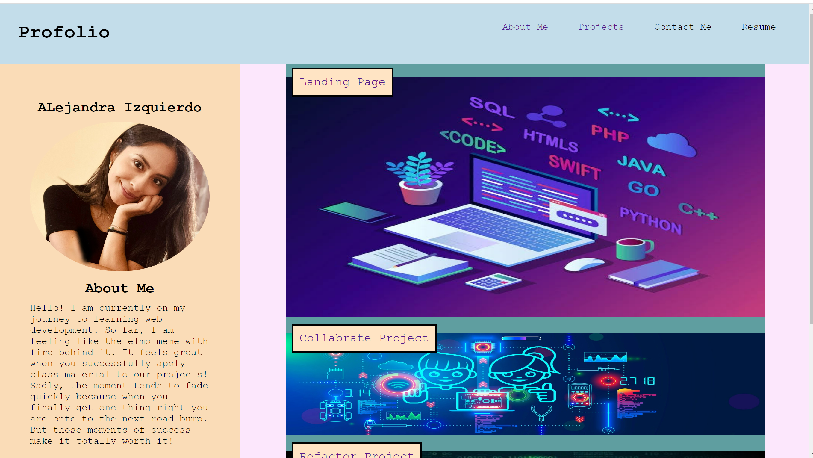

# Alejandra.I-Porfolio

## Description 
/*what, why, how*/
Hello! 
Welcome to a profolio I have created, displaying some of the projects I have done.
I have created this profolio to showcase some of the work I have done throughout my bootcamp course. This profolio itself displays my abilities and comfort with HTML and CSS. 

Navigation: I have included a navigation bar that will help navigate you throughout the page. 
About Me: In the about me section, you can read about myself and my current bootcamp journey.
I have included three of the projects I have created or worked on with another peer in the class. You can find his GitHub down below for further reference. Each project has a button that will depoly the project I am referencing. 
Finally, I have included a footer that will provide you with my contact information if you wish to contact me for questions, thoughts, or tips.
/*include challenges and goals*/
Challenges: Media queries, I tried to research them, watch videos but I still seem to be missing something. 

Future goals: My future goals with this project is tackle media queries within my profolio. I also plan to utilize this profolio as a starting point to my creativity behind my profolio. I hope within time you can see my development throughout my profolio display itself and also the work it displays within the page. I hope in the end to be able to better this design significantly. 

Deployed application listed below:


## Usage
/*screenshot*/
You may use this page to access information about myself, projects I've created and for creative development. 
```md

```

## Credits
Collaborate mini project was done with Dylan kreisman, you can assess the page through his GitHub--> username:dylankreisman

Landing Image retrieved from:
https://img.freepik.com/free-vector/software-development-programming-language-coding_284092-33.jpg?w=1380
Image provided by Freepik--> user butaleva_stock

Mini-Project Image retrieved from:
https://www.worldbook.com/images/WBBlog_KidsCoding.jpg
Image provided by World Book Inc.

Refactor Image retrieved from:
https://www.shutterstock.com/image-vector/abstract-futuristic-cyberspace-binary-code-matrix-740523562
Image provided by Shutterstock

Tools/websites used to complete assignment listed below with links:
https://www.w3schools.com/ -->used for css styling: grid, column, effects, box-shadowing, hover, etc.
https://developer.mozilla.org/en-US/docs/Web/CSS/CSS_Columns/Styling_Columns --> used for css styling (columns)


## License 
MIT License

Copyright (c) 2022 Ale

Permission is hereby granted, free of charge, to any person obtaining a copy
of this software and associated documentation files (the "Software"), to deal
in the Software without restriction, including without limitation the rights
to use, copy, modify, merge, publish, distribute, sublicense, and/or sell
copies of the Software, and to permit persons to whom the Software is
furnished to do so, subject to the following conditions:

The above copyright notice and this permission notice shall be included in all
copies or substantial portions of the Software.

THE SOFTWARE IS PROVIDED "AS IS", WITHOUT WARRANTY OF ANY KIND, EXPRESS OR
IMPLIED, INCLUDING BUT NOT LIMITED TO THE WARRANTIES OF MERCHANTABILITY,
FITNESS FOR A PARTICULAR PURPOSE AND NONINFRINGEMENT. IN NO EVENT SHALL THE
AUTHORS OR COPYRIGHT HOLDERS BE LIABLE FOR ANY CLAIM, DAMAGES OR OTHER
LIABILITY, WHETHER IN AN ACTION OF CONTRACT, TORT OR OTHERWISE, ARISING FROM,
OUT OF OR IN CONNECTION WITH THE SOFTWARE OR THE USE OR OTHER DEALINGS IN THE
SOFTWARE.


